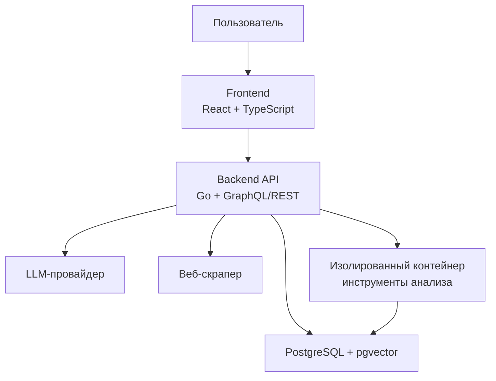

# DpmAGI

**DpmAGI** - дипломный проект, посвященный разработке интеллектуальной системы автоматизированного анализа безопасности веб-сервисов. Система объединяет веб-интерфейс, серверную часть, базу данных, изолированные Docker-контейнеры и LLM-агентов, которые помогают выполнять безопасный black-box анализ только в рамках разрешенного тестирования.

Проект предназначен для демонстрации практического применения больших языковых моделей в задачах информационной безопасности: разведка веб-приложения, анализ HTTP-заголовков, проверка cookies, поиск типовых ошибок конфигурации, сбор наблюдений и формирование структурированного отчета.

## Назначение дипломной работы

Цель работы - спроектировать и реализовать прототип системы, которая помогает специалисту по информационной безопасности проводить первичный аудит веб-сервисов с использованием LLM-агентов и изолированной среды выполнения.

Основные задачи:

- разработать архитектуру системы с разделением на frontend, backend, хранилище данных и контейнеры выполнения;
- организовать запуск проверок в изолированной Docker-среде;
- подключить LLM-провайдера для планирования, анализа и генерации отчета;
- сохранить историю сценариев, задач, подзадач, логов и результатов;
- сформировать понятный веб-интерфейс для запуска и контроля анализа;
- подготовить проект к демонстрации как выпускную квалификационную работу.

## Возможности

- Создание сценариев анализа веб-сервисов.
- Автоматическое разбиение пользовательской цели на задачи и подзадачи.
- Работа LLM-агентов с ролями: планирование, поиск, анализ, уточнение и подготовка отчета.
- Выполнение команд и сетевых запросов внутри отдельного Docker-контейнера.
- Сбор HTML, HTTP-заголовков, cookies, ответов сервера и логов выполнения.
- Хранение данных в PostgreSQL с поддержкой векторного расширения.
- Просмотр статуса выполнения через веб-интерфейс.
- Поддержка REST и GraphQL API для интеграции и отладки.
- Возможность подключения внешних LLM-провайдеров через OpenAI-совместимый API.

## Ограничения и безопасность

DpmAGI предназначен только для легального и авторизованного анализа. Система должна использоваться для учебных, исследовательских и внутренних проверок, где у пользователя есть разрешение на тестирование.

В рамках демонстрационного сценария рекомендуется ограничиваться безопасными действиями:

- passive reconnaissance;
- HTTP(S) GET-запросы;
- анализ открытых страниц и статических ресурсов;
- проверка заголовков, cookies и клиентских артефактов;
- отсутствие брутфорса, DoS, эксплуатации уязвимостей и доступа к чужим данным.

## Архитектура



Ключевые компоненты:

- `frontend` - клиентская часть веб-интерфейса.
- `backend` - серверная логика, API, управление сценариями и агентами.
- `pgvector` - PostgreSQL-хранилище для пользователей, сценариев, задач, логов и векторных данных.
- `scraper` - сервис для получения и обработки веб-страниц.
- Docker-контейнеры сценариев - изолированная среда, где выполняются команды анализа.
- Конфигурационные файлы провайдеров - YAML-файлы с настройками моделей для разных ролей агентов.

## Структура репозитория

```text
.
├── backend/                         # Серверная часть на Go
├── frontend/                        # Веб-интерфейс
├── examples/                        # Примеры конфигураций и сценариев
├── observability/                   # Конфигурации мониторинга
├── scripts/                         # Служебные скрипты
├── docker-compose.yml               # Основной Docker Compose-файл
├── docker-compose-langfuse.yml      # Дополнительная LLM-наблюдаемость
├── docker-compose-observability.yml # Метрики, логи и трассировка
├── docker-compose-graphiti.yml      # Дополнительный граф знаний
├── Dockerfile                       # Сборка основного образа
├── .env.example                     # Пример переменных окружения
└── README.md                        # Описание дипломного проекта
```

## Требования

- Docker Desktop или Docker Engine.
- Docker Compose.
- Доступ к LLM-провайдеру.
- API-ключ LLM-провайдера, если используется облачная модель.
- Свободные локальные порты, указанные в `.env`.

## Быстрый запуск

1. Создать файл окружения:

```powershell
Copy-Item .env.example .env
```

2. Заполнить основные параметры в `.env`:

```env
PUBLIC_URL=https://localhost:8443
SERVER_HOST=0.0.0.0
SERVER_PORT=8443

LLM_SERVER_URL=https://openrouter.ai/api/v1
LLM_SERVER_KEY=your_api_key_here
LLM_SERVER_MODEL=

EMBEDDING_PROVIDER=none
```

3. Запустить сервисы:

```powershell
docker compose up -d
```

4. Проверить состояние контейнеров:

```powershell
docker compose ps
```

5. Открыть веб-интерфейс:

```text
https://localhost:8443
```

Браузер может предупредить о самоподписанном TLS-сертификате. Для локальной демонстрации это ожидаемое поведение.

## Настройка LLM

DpmAGI использует роли агентов, каждая из которых может работать на отдельной модели. Основной файл конфигурации для OpenRouter-совместимого запуска:

```text
examples/configs/openrouter.provider.yml
```

В нем задаются модели для ролей:

- `primary_agent` - основной агент управления сценарием;
- `generator` - разбиение цели на задачи;
- `searcher` - поиск и сбор открытой информации;
- `pentester` - анализ безопасности;
- `reflector` - проверка и уточнение ответа;
- `coder`, `installer`, `assistant` - дополнительные роли.

Если провайдер возвращает ошибку о недоступной или устаревшей модели, нужно заменить модель в YAML-конфиге и пересоздать основной контейнер:

```powershell
docker compose up -d --force-recreate
```

## Демонстрационный сценарий

Пример безопасной постановки задачи для веб-интерфейса:

```text
Проведи авторизованный black-box анализ веб-сервиса https://example.com/
без доступа к исходному коду. Используй только безопасные проверки:
HTML/CSS/JS, HTTP-заголовки, cookies, формы, параметры URL,
видимые ошибки и клиентские логи. Не выполняй DoS, брутфорс,
эксплуатацию уязвимостей и доступ к чужим данным.

В конце составь отчет с приоритетами, доказательствами наблюдений,
потенциальным влиянием и рекомендациями по исправлению.
```

Ожидаемый результат:

- список выполненных задач;
- инвентаризация найденных URL и форм;
- наблюдения по заголовкам, cookies и конфигурации;
- оценка рисков;
- итоговый отчет с рекомендациями.

## Диагностика

Проверить контейнеры:

```powershell
docker compose ps
```

Посмотреть логи:

```powershell
docker compose logs -f
```

Пересоздать сервисы после изменения `.env` или YAML-конфигов:

```powershell
docker compose up -d --force-recreate
```

Остановить проект:

```powershell
docker compose down
```

Если сценарий остановился в состоянии `waiting`, обычно требуется:

- проверить логи на ошибки LLM-провайдера;
- заменить недоступную модель в provider-конфиге;
- пересоздать контейнеры;
- продолжить сценарий через веб-интерфейс новым сообщением.

## API

После запуска доступны:

- REST API: `https://localhost:8443/api/v1`
- GraphQL endpoint: `https://localhost:8443/api/v1/graphql`
- GraphQL Playground: `https://localhost:8443/api/v1/graphql/playground`
- Swagger UI: `https://localhost:8443/api/v1/swagger/index.html`

API можно использовать для просмотра сценариев, задач, логов, контейнеров и статистики выполнения.

## Разработка

Основной стек:

- Go - backend и серверная бизнес-логика;
- React + TypeScript - frontend;
- PostgreSQL + pgvector - хранение структурированных и векторных данных;
- Docker Compose - запуск инфраструктуры;
- GraphQL и REST - API;
- YAML - конфигурация LLM-агентов;
- OpenTelemetry-совместимые компоненты - наблюдаемость.

Для локальной разработки удобно запускать инфраструктуру через Docker Compose, а изменения frontend/backend проверять отдельно в соответствующих директориях.

## Результат дипломной работы

Результатом является работающий прототип системы DpmAGI, который демонстрирует:

- применение LLM-агентов в задачах анализа безопасности;
- автоматизацию этапов первичной веб-разведки;
- изоляцию инструментов анализа в контейнерах;
- хранение и отображение хода выполнения сценариев;
- формирование технического отчета по результатам проверки.

Проект может быть расширен за счет добавления новых ролей агентов, дополнительных безопасных проверок, улучшенной визуализации отчетов и интеграции с системами мониторинга.
